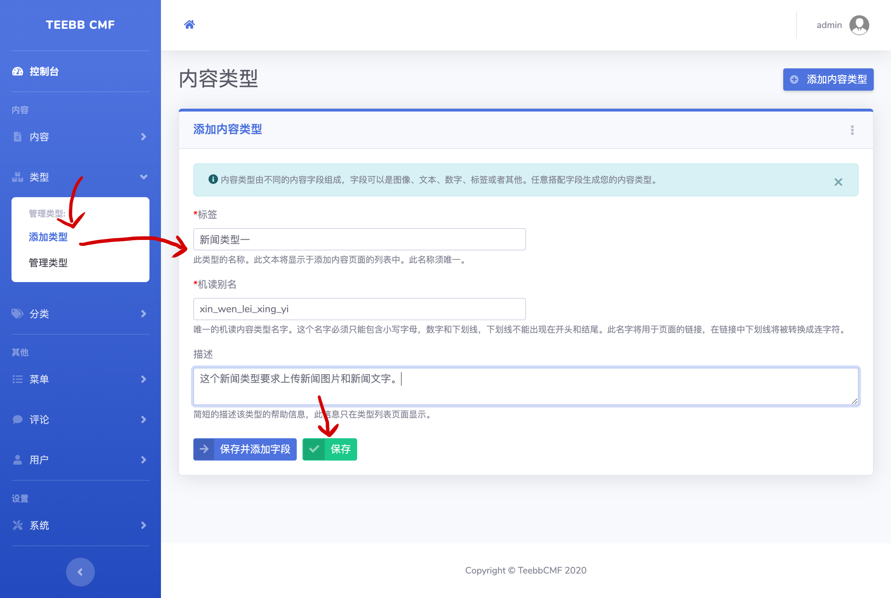

#### 3.1 内容bundle
内容bundle的主要功能是用于存储管理不同类型的内容。上文提到的新闻就由内容bundle存储管理。下文将完整实现一个新闻类型的创建及添加。 

##### 3.1.1 创建第一个内容类型
Teebb已经内置了文章（article）和基本页面（page）两种内容类型，但是我们需要为我们的新闻创建新的类型，请看下图操作：  
  

如上图我们填写内容类型表单并点击保存并添加字段或保存按钮即可，我们在下节会详细介绍字段。