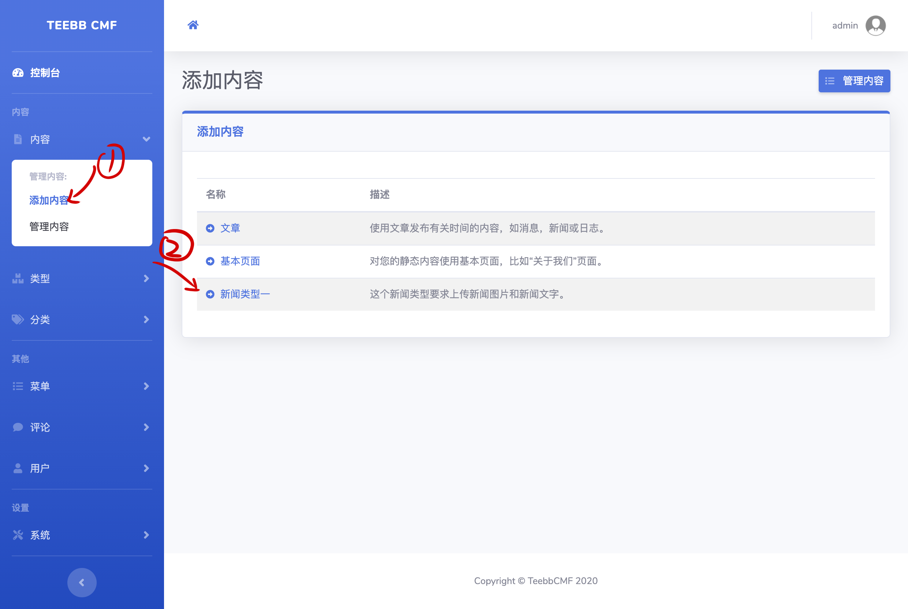
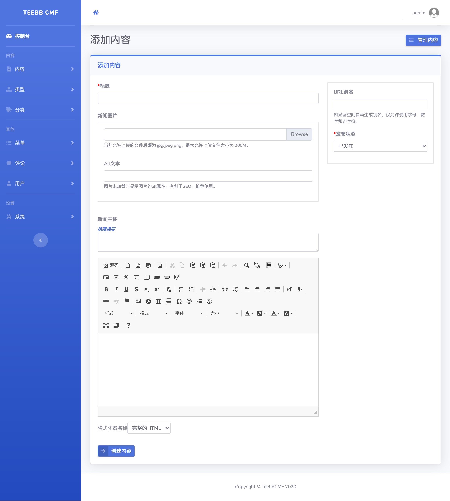
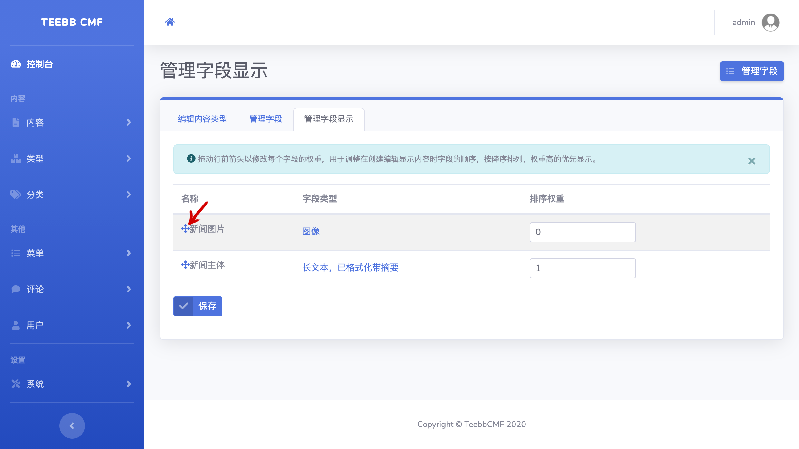

#### 3.3 内容

##### 3.3.1 添加内容
我们的“新闻类型一“内容类型已经创建完成，现在我将发表我的第一篇新闻。  
点击“内容”-> “添加内容”->“新闻类型一”:  
   
Bingo！您将会发现添加内容表单将各字段的表单都自动添加了进来，下面我们将新闻的内容填写进去，点击保存即可完成我们的第一篇新闻。  
  
> Tips：您可能想先写新闻主体，再上传图片。我们只需调整字段显示顺序即可：  
> 点击：“管理类型”->“新闻类型一”->“管理字段显示”，拖动左侧“十字箭头”即可调整字段顺序。记得点击“保存”。  

  
 
##### 3.3.2 内容的查询（未实现，后续版本实现）