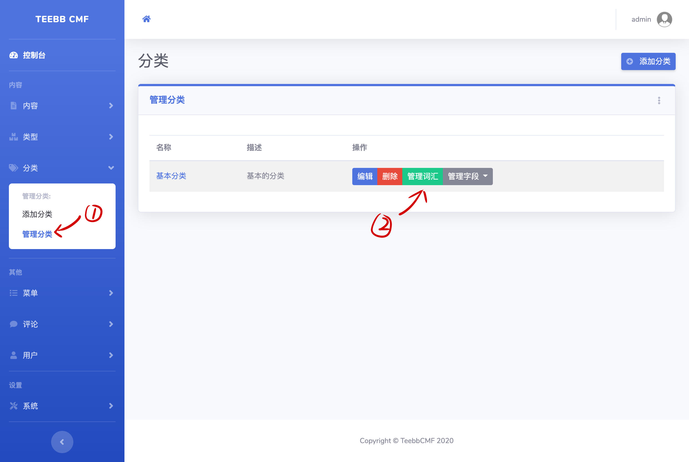
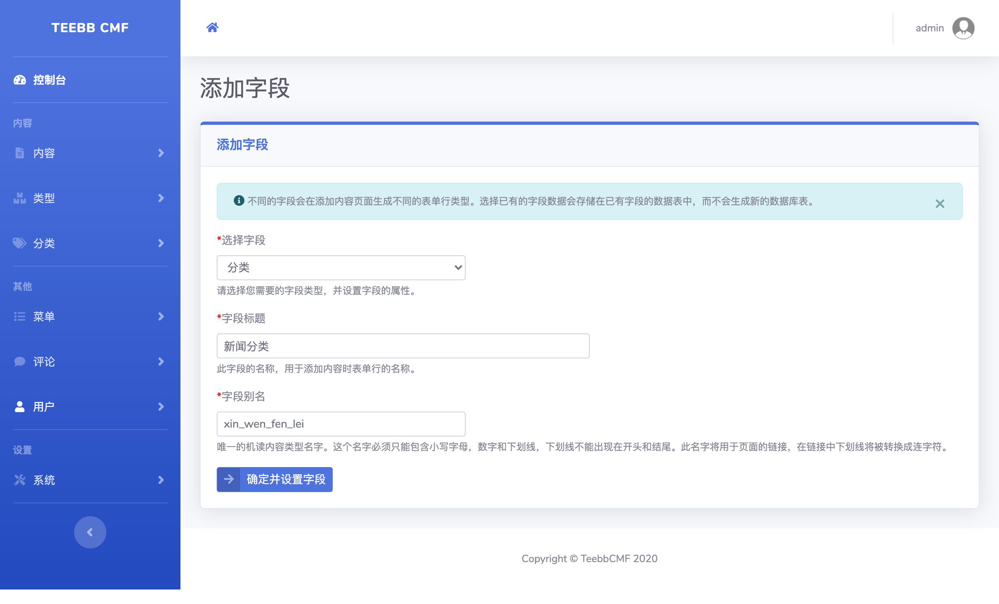
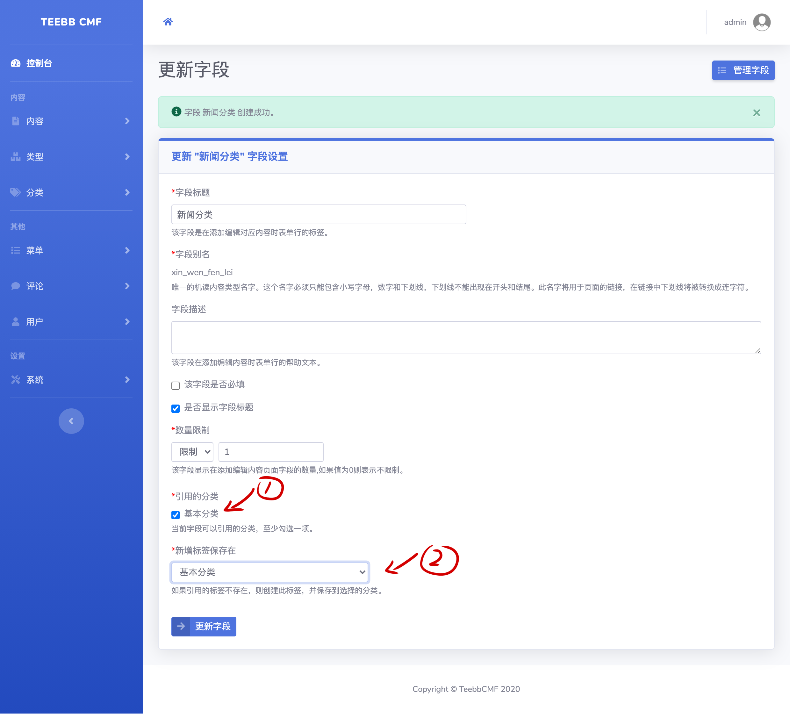
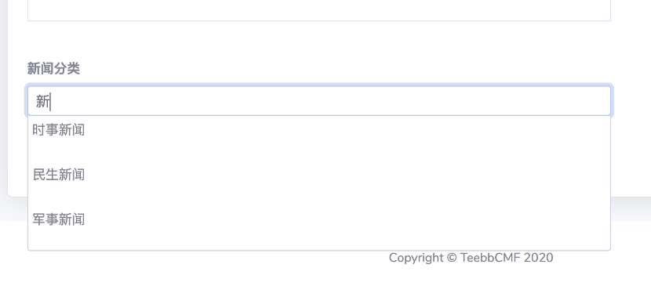

#### 3.4 分类bundle
分类bundle和内容bundle类似，不同的是分类bundle管理的是分类词汇（Term），不同的分类类型可以包含不同的字段。
举例：常见的商城类APP分类中每个分类可能需要配一个小图片，我们可以创建分类类型，给分类类型添加图像字段以实现此效果。

##### 3.4.1 创建分类类型
和创建内容类型相似，点击：“添加分类”-> “保存”或 “保存并添加字段”。分类的别名将用于URL中也要全局唯一。

##### 3.4.2 分类类型中字段的设置
分类的字段和内容类型中的字段设置操作一致。

##### 3.4.3 添加分类词汇
当我们的内容类型中使用了“分类”字段，则需要首先在对应的分类类型下添加分类词汇。点击“管理分类”->选择对应的分类类型->“管理词汇”->“添加词汇”。如下图操作：  
 

 

##### 3.4.4 分类字段的使用
在添加完几个词汇后，现在我们想给之前的“新闻分类一”添加一个分类引用。“内容”->“管理类型”->“管理字段”->“添加字段”->选择“分类”字段。如下图：  
   

  
> Tips: 分类字段设置图片中1号标记请选择要引用的分类类型。2号标记功能暂未实现，请忽略。  

设置好分类字段后，我们重新添加/编辑内容。Wooooo！ 分类字段的表单行已经出现了，我们输入相关的分类词汇，会下拉提示对应的词汇，并点击保存。
 
