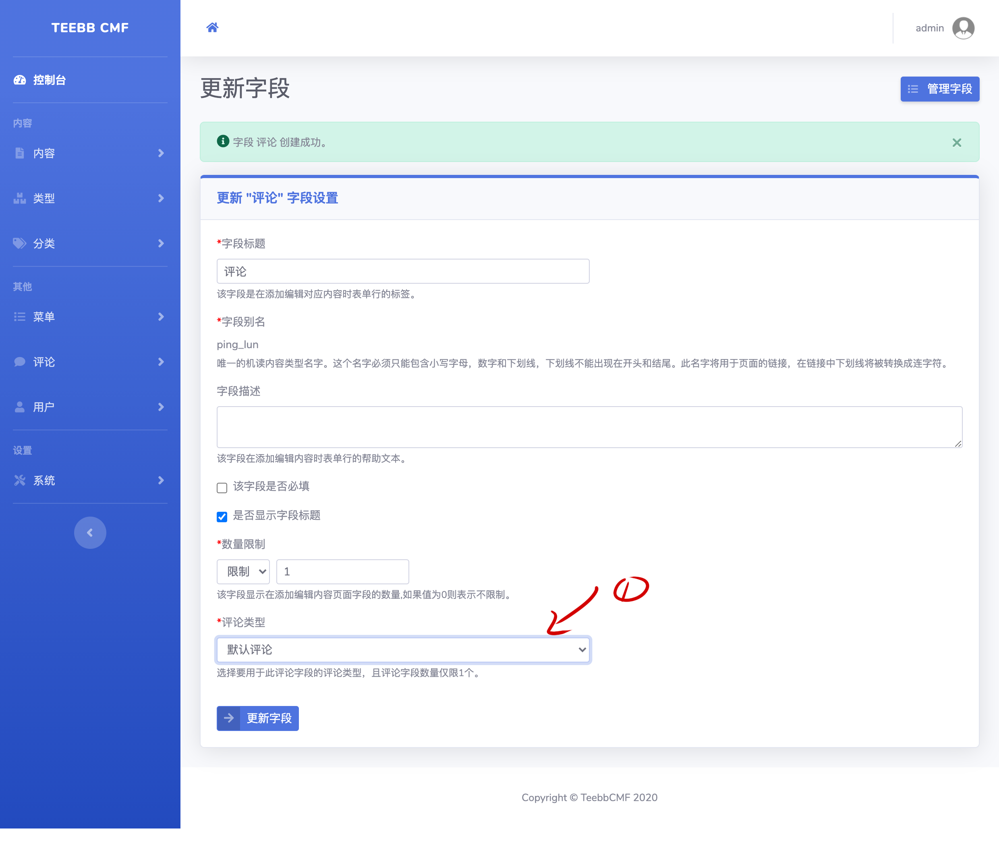
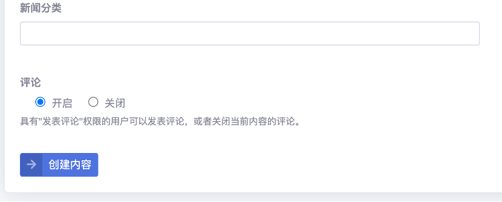
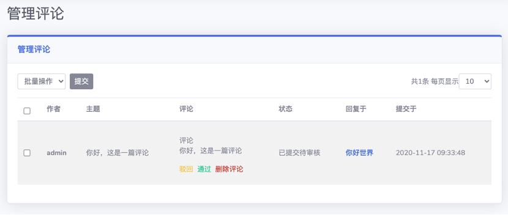

#### 3.5 评论bundle
评论bundle和内容bundle、分类bundle操作基本相同。

##### 3.5.1 创建评论类型
TEEBB已经内置了“默认评论”类型。您也可以创建不同类型的评论。操作方法与创建内容类型相同。

##### 3.5.2 评论类型中字段的设置
评论类型中字段的设置与前几节相同。  

##### 3.5.3 评论字段的使用
现在我们给“新闻类型一”的内容添加评论功能。和之前操作一样，给“新闻类型一”添加“评论”字段。“类型”->“管理类型”->“新闻类型一”->“管理字段”->“添加字段”->选择“评论”字段。  
> Tips：“评论”类型字段的显示顺序永远在内容页面最底部，多个“评论”字段则按字段顺序依次排列到页面底部。

  
设置完“评论字段”，我们需要为每篇内容单独打开评论。因此，请您在创建内容类型时确定是否需要评论功能，以免不必要的工作。  

在新建/编辑内容页面您将看到下图所示“评论”字段的表单：
 

> Tips: 评论功能只在前台页面显示。TEEBB默认只有已注册登录的用户可以发表评论，且评论内容经过审核后才可显示。

##### 3.5.4 管理评论内容
“评论”->“管理评论类型”->“管理评论”。您可以在此页面对已提交的评论进行操作。
 