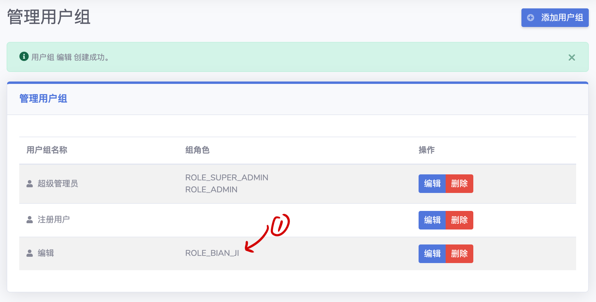
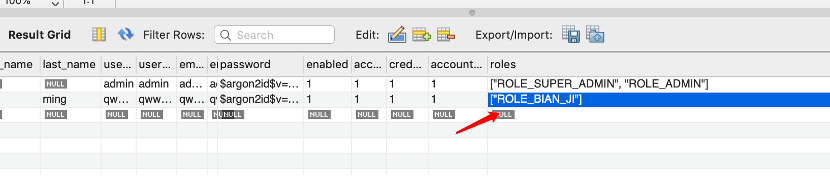

#### 3.6 用户与用户组

##### 3.6.1 用户的概念
TEEBB中的用户（User）也用到了bundle，可以增加修改字段以实现用户信息的扩展性，但是用户只有默认一种类型。

##### 3.6.2 用户的字段设置（后续版本实现）

##### 3.6.3 用户组及权限
在TEEBB中我们使用用户组也管理用户的权限，如果修改了用户所在的用户组，则用户的roles属性也会相应改变，此功能主是要为了方便的使用Symfony中的Security组件，对用户访问进行控制。  
  

  
